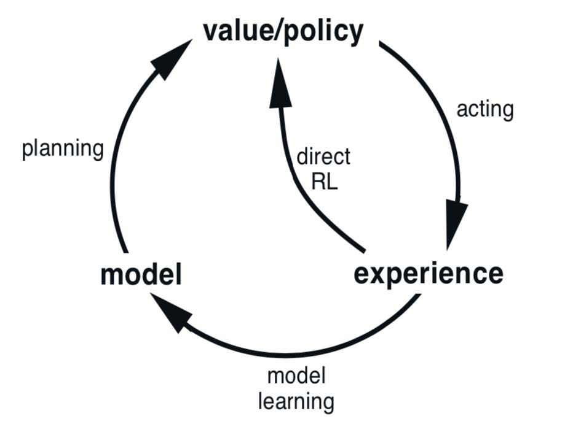
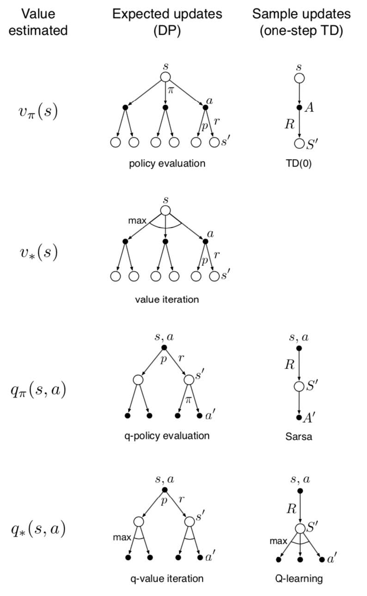
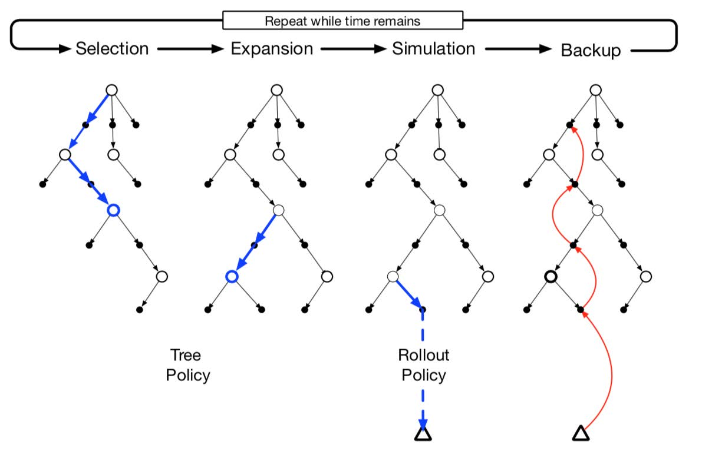

> **前言：** 本次笔记对《强化学习（第二版）》第八章进行概括性描述。同时，也对本书的第一部分（共三部分）表格型求解方法进行了系统性阐述。

*以下概括都是基于我个人的理解，可能有误，欢迎交流：piperliu@qq.com。*

****

### 一、表格型求解方法梳理知识

#### 第二到七章知识总结

第八章学习完成后，标志着书中第I部分 **表格型求解方法** 的完结，目前已学习到的知识包括：
- **多臂赌博机问题：** 在一个稳定的单状态环境中，如何评估各动作价值，并进行控制（选择下一动作，试探 exploration 还是开发 exploitation，开发的依据是什么）；
- **有限马尔科夫决策过程：** 如何对环境、动作、收益建模（如何把待解决问题抽象成数学上的表达）？什么是幕 episode ？强化学习的基本元素有？
- **动态规划：** 在环境已知的条件下（什么是环境已知：状态转移概率已知，且环境稳定不随机变动；或者说状态转移可以用概率描述），如何评估基于某策略的状态的价值 $v_\pi(s)$ ？如何评估基于某策略的，在某状态下选择该动作的价值 $q_\pi(s,a)$ ？并且，如何通过迭代，逼近该环境下的最优策略（得到最优策略，叫做控制）？
- **蒙特卡洛方法：** 在环境不可知的条件下，可以通过与环境的交换获取信息。那么，这种条件下如何进行 $v_\pi(s)$ 、 $q_\pi(s,a)$ 的评估？蒙特卡洛方法基于很多幕的数据进行“学习”。环境对于动作的选择是基于我们要评估的策略 $\pi$ 的，称之为同轨策略 on-policy ，否则称之为 离轨策略 off-policy 。要实现离轨策略下的控制，就必须对交互得到的信息进行处理，一般地，我们使用采样率 sampling ratio 进行处理。
- **时序差分学习：** 蒙特卡洛方法要求到幕结束时，才可使用幕的过程中的信息。有没有可以不用等到幕结束，立即更新对价值的评估的方法呢？时序差分学习给出了答案。这涉及到了一个问题：为了更新当前状态/动作的价值，那就要用到下一步状态的价值，如何评估下一步状态的价值？ Sarsa 、 Q-Learning 、 期望 Sarsa 给出了参考。同样，在控制中，讨论了同轨策略与离轨策略。并且，在可能产生最大化偏差的背景介绍下，介绍了双学习这个解决办法，双学习的期望是无偏的。
- **n 步自举法：** 蒙特卡洛方法等到幕结束，时序差分学习立即更新，但事实证明，基于两种之间的学习方法好于两者，即并非“无限步直到幕结束”或“1步”，使用n步最好。这涉及到多个结点，每个结点采用何种规则回溯，来评估当前价值状态呢？有采样率、树回溯、采样率+期望、交叉进行期望与采样率等等方法。

可以注意到，后三章**蒙特卡洛方法、时序差分学习、n 步自举法**并不基于规划，即，**无需对环境建模**，只需要利用环境的 output 与 input 就可以进行学习。

**但第八章又回到了规划上。**

#### 第八章：与二到七章的关系

尽管要用到模型（与规划），但是第八章中的条件并不需要像第四章**动态规划**中那样苛刻：
- 不知道环境的完备模型也行，我可以自己仿真一个环境，对“仿真系统”进行输入输出，来学习各个状态/动作的价值；
- 现在有了（仿真好的）环境，也**未必要使用传统动态规划的更新方法（期望更新）**，对每个子节点加权求和（即求父结点期望），因为环境可能很复杂，而很多状态是无用的（任何一种“聪明的”策略都不会到达那种状态），也就没必要遍历，或者评估价值 **（在规划的前提下，依旧使用采样更新，来减少计算量）**；
- 因此，本章提出了许多有趣而有用的方法：**基于更新效果（走这一步，是否会令原价值变化很小，若很小，则没必要考虑这个更新）决定更新优先级的优先遍历**、**基于轨迹进行采样**、**实时动态规划（只更新经历过的状态，on-policy，采样更新的动态规划）**、**启发式搜索/决策时规划（聚焦当前状态/决策，计算各种后续可能动作的价值，但不存储他们，只进行启发式搜索）**、**预演算法**与**蒙特卡洛树搜索**。

可以看出，第八章就是：
- 使用了动态规划的“规划”思想；
- 或者说 Dyna-Q 将规划与时序差分结合了起来；
- 但在规划中未必要使用“期望更新”，很多状态可以忽略；
- 在更新时可以利用“规划”，预演出后续状态，只为了对当前状态/决策进行评估（预演出的状态产生的价值无需储存）。

****

### 二、第八章基于表格型方法的规划和学习各节概括

> 参考了下述项目的笔记部分：
> [https://github.com/brynhayder/reinforcement_learning_an_introduction](https://github.com/brynhayder/reinforcement_learning_an_introduction)

#### 8.1 模型和规划 Models and Planning

对环境建模，即帮助智能体去预测环境对于动作的反馈是什么，模型分为两类：
- 分布模型 distribution model ，返回反馈的概率分布；
- 样本模型 sample ，返回一个具体的反馈。

模型时用于仿真环境的。

#### 8.2 Dyna：集成在一起的规划、动作和学习 Dyna: Integrated Planning, Acting and Learning

如上图， Dyna-Q 算法结合了 Q-Learning 与 规划：
- 正常的Q更新结束之后，对模型进行更新；
- 依据现有模型，进行n次循环，对已出现过的 $Q(S, A)$ 进行更新。

#### 8.3 当模型错误的时候 When the Model is Wrong

当采样不足或者陷入局部次优解时，就会让模型产生偏差。 Dyna-Q+ 用一个指标鼓励模型采取未采取过的动作，来解决这个问题。

### 8.4 优先遍历 Prioritized Sweeping

许多状态是与最优策略无关的，换言之，逼近最优策略，用不着对无关状态采样。

好比，小明从沈阳出发去成都，被要求找一条最近的路，他可以来来回回好几趟。他可能经过北京，可能经过西安，但一定没有必要先去东京，再去成都。这里，“抵达东京”这个状态与我们“从沈阳到达成都的最短路径”这个最优策略目标无关。

优先遍历的方法被提出，来过滤那些没有用的采样。比如，在一个非随机的环境中，使用 Q-Learning ，如果：

$$|R+\gamma \max_a Q(S',a) - Q(S, A)| < \theta$$

那么，才把这个 P 对应的状态放在 PQueue 中，进行更新。

#### 8.5 期望更新与采样更新的对比 Expected vs. Sample Updates

当模型时分布模型时，或者有很多很多状态分支时，进行期望更新计算量太大（ $\sum_i^{s\_number} p_i q_i$ ）中s_number过大。因此，采用采样更新代替期望更新。

事实证明，在计算量很大/迭代次数很多时，采样更新的效果不逊于期望更新。

这是一张较为精辟的图，来自书中。这是一个三维图：
- 维度一：**当前策略还是最优策略**，按照我的理解，因为同轨策略 on-policy 中，策略可以随着迭代而更新，采样也可以随之更新，因此当前策略多用于同轨策略，而最优策略下的估计多用于离轨策略；
- 维度二：**状态价值还是状态-动作价值期望**，前者多用于价值评估，或者多用于控制；
- 维度三：**期望更新还是采样更新**。

#### 8.6 轨迹采样 Trajectory Sampling

对平均分布进行采样，可能会带来偏差。因为，很多“样本”其实是根本不会出现的。在规划中对同轨策略采样可以带来“初期快速收敛”的效果。

#### 8.7 实时动态规划 Real-time Dynamic Programming

实时动态规划是一种特殊的价值迭代：不同于传统动态规划，实时动态规划不采用期望更新，使用采样更新，对同轨策略下的轨迹进行采样。

#### 8.8 决策时规划 Planning at Decision Time

何为在决策时规划？

在之前提到的算法中，我们都是基于已有的经验进行规划（background planning）；决策时规划即，考虑与环境的交换，即模拟作出动作后可以进行的采样（有可能考虑很多步）。

#### 8.9 启发式搜索 Heuristic Search

在我看来，是对将要选择的动作进行“推演”，建立一个“决策树”，并且依照某种顺序（深度优先）对分支进行“不集中”的回溯。这往往比“集中回溯更新”产生的决策效果好。

#### 8.10 预演算法 Rollout Algorithm

预演算法是基于蒙特卡洛控制的、通过仿真迹进行采样的决策时规划。

预演算法即：
- 从某个状态出发；
- 基于一个策略（预演策略），进行仿真，评估价值；
- 选择仿真中价值最高的动作，以此类推。

预演算法用于改进预演策略的性能，而非找到最优策略。

#### 8.11 蒙特卡洛树搜索 Monte Carlo Tree Search

蒙特卡洛树搜索是决策时规划、预演算法的集大成者。预演算法是其价值评估的框架，在仿真时，应用蒙特卡洛仿真来引导搜索。AlphaGo使用了这种技术。

MCTS可以概括为四步：
- 选择 Selection ，基于树策略（树策略考虑了树边缘的动作价值）价值选择一个叶子结点；
- 扩展 Expansion ，对选定的结点进行非试探动作，为其增加子结点；
- 仿真 Simulation ，从叶子结点或新增叶子结点开始，基于预演策略进行整个一个幕的仿真。在树中的部分，基于蒙特卡洛树的策略进行策略选择，在树外的部分，则基于预演策略；
- 回溯 Backup ，在本次更新中，对轨迹的回报值上传，树外的状态和动作都不会被保存下来。

如上图，按照我的理解，MCTS的这四个步骤，即：
- **逐渐扩张树的过程：** 树本身代表了一种策略，但是在第一次更新前，树是不存在的，每一次更新（一次更新中进行上述四个步骤），树都将生长一点（生长一个叶子，还是几个叶子，it depends）；
- **逐渐更新树的过程：** 在仿真的步骤中，如果状态是树内的，则基于树策略进行仿真，一旦跑出树外，则基于预演策略进行仿真；由此回溯，**树会越来越健壮**；
- 对树外策略进行仿真，并且基于蒙特卡洛控制（要仿真到幕结束），应该是为了让回报更准确，与环境交互更加充分；
- 就好比，高级的围棋手会在脑中推演好几步：如果我们这下了，对方会怎么下，我再怎么下...
- 应该注意，这张图片对于初学者（如今天上午的我）有一定误导性：**每次学习时，我们遇到的状态未必是树的边缘结点或者根结点；在很多次学习之后（机器下了很多盘棋之后），再开局，树已经很全面，很健壮了。**

### 强化学习初步/表格型求解方法总结

Sutton的书所提到的所有强化学习方法都包含三个重要思想：
1. 需要估计价值函数；
2. 需要沿着真实或者模拟的状态轨迹进行回溯操作来更新价值估计；
3. 遵循广义策略迭代（GPI）的通用流程，即会维护一个近似的价值函数和一个近似的策略，持续地基于一方的结果来改善另一方。

****

期待后续的学习。

*Piper Liu*

*2020-1-31 23:38:22*
